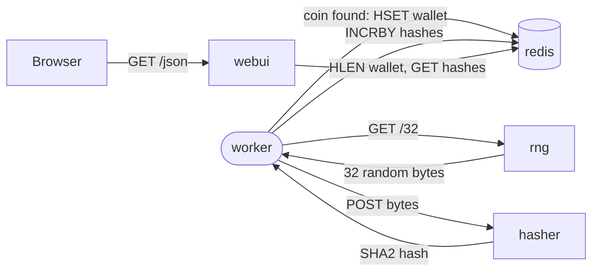

# k8coins

A small polyglot microservices app used as the throughline demo in Platform
Fix's Kubernetes workshops. Five services, four languages. An orchestrator
doesn't care what runtime a service is written in. It cares whether the
container starts, holds a port open, and reports its own health.

k8coins "mines" coins by hashing random bytes and checking whether the
resulting hash happens to start with a zero. That's the entire business
logic, deliberately. The workshop teaches deploying, scaling, and debugging
a system with real inter-service dependencies, and the app exists only to
give that system something to do. rng generates the data, worker drives
the loop, hasher does the hashing, redis holds the state, webui shows the
rate.

The app is adapted from
[jpetazzo/container.training](https://github.com/jpetazzo/container.training)'s
DockerCoins. See [Attribution](#attribution).

## Architecture

| Service | Language | Role |
|---|---|---|
| `rng` | Python (Flask) | Generates random bytes on request |
| `hasher` | Ruby (Sinatra) | Hashes whatever bytes it's given |
| `worker` | Python | Drives the loop: fetch bytes, hash them, check for a coin, record the result |
| `webui` | Node.js (Express) | Reads the current rate from redis and serves it to the browser |
| `redis` | off-the-shelf (`redis:7-alpine`) | Holds the running counters |

`worker` is the only service with real logic. Every second of runtime, it
asks `rng` for 32 random bytes, sends those bytes to `hasher`, and checks
whether the returned SHA-2 hash starts with `0`. If it does, that's a coin:
the hash and the bytes that produced it go into a redis hash called
`wallet`. Either way, `worker` tallies how many hash attempts it made and
periodically adds that count to a redis counter called `hashes`. `webui`
polls redis for the size of `wallet` and the value of `hashes`, and serves
both as JSON to the browser.



No service talks to more than one downstream neighbor. `rng` and `hasher`
never touch redis directly; `webui` never talks to `rng`, `hasher`, or
`worker`. That's on purpose: it's what makes the app a useful teaching
target for service discovery, network policy, and failure isolation
exercises. Kill `hasher` mid-workshop and `worker` stalls, but `webui`
keeps serving whatever counts it last read.

## Running locally

```bash
docker compose up
```

This builds and starts all five services:

- webui: [http://localhost:8000](http://localhost:8000)
- rng: [http://localhost:8001](http://localhost:8001)
- hasher: [http://localhost:8002](http://localhost:8002)

`worker` and `redis` aren't exposed to the host; they only need to be
reachable from the other containers, which Compose handles via the
default network. Give it 10-15 seconds, then check `http://localhost:8000/json`
for a non-zero `hashes` count.

## Published images

Each built service publishes to GHCR on every release, tagged with the
release version and `latest`:

```
ghcr.io/platformfix/k8coins-rng:<version>
ghcr.io/platformfix/k8coins-hasher:<version>
ghcr.io/platformfix/k8coins-worker:<version>
ghcr.io/platformfix/k8coins-webui:<version>
```

`redis` isn't built by this repo; use the upstream `redis:7-alpine` image
directly. The images are currently private, matching this repo's
visibility, and will open up if and when the repo does.

## Versioning and releases

The whole repo is versioned as one unit rather than as five
independently-versioned services. Every merge to `main` inspects the
commit messages since the last tag and bumps accordingly: a `feat:` commit
bumps minor, a breaking-change marker (`!` after the type, or a
`BREAKING CHANGE` footer) bumps major, anything else bumps patch. That
version becomes the new git tag, a GitHub Release, and the tag applied to
all four images on GHCR in the same run.

There's no manual version bump and no changelog to maintain by hand. The
current version always matches the latest tag; check the
[Releases page](https://github.com/platformfix/k8coins/releases) or
`git tag` rather than trusting a number written into prose.

## Dockerfile practices

Every Dockerfile in this repo follows the same pattern, deliberately, so it
doubles as a reference for the practices it demonstrates:

- **Multi-stage builds.** Build tooling (`build-base` for the Ruby gem with
  a native extension, `pip`/`npm` install caches) lives only in the
  builder stage. The final image copies across installed dependencies and
  application code, nothing else.
- **Numeric UID, not a named user.** Each image creates and runs as UID
  1000 rather than a named non-root user. Kubernetes' `runAsNonRoot`
  check and most static-analysis tooling resolve a numeric UID reliably
  and a named user unreliably (they'd need to read `/etc/passwd` inside
  the image to resolve it), so numeric is the version that actually gets
  enforced.
- **Pinned dependencies.** `requirements.txt` pins exact versions,
  `Gemfile.lock` locks exact gem versions, and `webui` installs from
  `package-lock.json` via `npm ci`. The Ruby build stage also pins the
  Alpine `build-base` package to an exact version. A rebuild six months
  from now installs the same thing it installed today.
- **Exec-form healthchecks.** `HEALTHCHECK CMD` is always the JSON-array
  form (`["wget", "-q", ...]`), never a bare shell string. Shell form runs
  the command through `/bin/sh -c`, which becomes the process that
  receives signals instead of the command itself; exec form avoids that
  and satisfies hadolint's DL3025.
- **hadolint in CI.** Every PR lints all four Dockerfiles with hadolint
  before anything builds, so a broken Dockerfile never reaches `main`.

## Attribution

k8coins is adapted from container.training's DockerCoins, Apache 2.0
licensed. See [`NOTICE`](NOTICE) for the upstream copyright and a summary
of what changed, and [`LICENSE`](LICENSE) for the license text.
