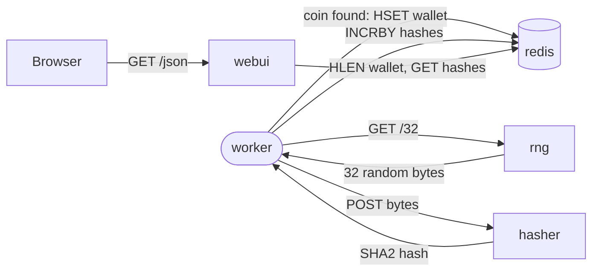

# Architecture

| Service | Language | Role |
|---|---|---|
| `rng` | Python (Flask) | Generates random bytes on request |
| `hasher` | Ruby (Sinatra) | Hashes whatever bytes it's given |
| `worker` | Python | Drives the loop: fetch bytes, hash them, check for a coin, record the result |
| `webui` | Node.js (Express) | Reads the current rate from redis and serves it to the browser |
| `redis` | off-the-shelf (`redis:7-alpine`) | Holds the running counters |

`worker` is the only service with real logic. In a continuous loop, it
asks `rng` for 32 random bytes, sends those bytes to `hasher`, and checks
whether the returned SHA-2 hash starts with `0`. Deliberate sleeps in
`rng`, `hasher`, and `worker` itself hold that loop to roughly three
attempts a second, slow enough to watch a counter move. If the hash does
start with `0`, that's a coin: the hash and the bytes that produced it go
into a redis hash called `wallet`. Either way, `worker` tallies how many
hash attempts it made and periodically adds that count to a redis counter
called `hashes`. `webui` polls redis for the size of `wallet` and the
value of `hashes`, and serves both as JSON to the browser.

The dependency graph is deliberately narrow. `worker` is the only service
that calls more than one neighbour; `rng` and `hasher` never touch redis,
and `webui` never talks to `rng`, `hasher`, or `worker`. That keeps the
app a useful teaching target for service discovery, network policy, and
failure isolation exercises. Kill `hasher` mid-workshop and `worker`
stalls, but `webui` keeps serving whatever counts it last read.

## Endpoints

Every service listens on port 80 (mapped locally per the ports in the
[README](../README.md#running-locally)). Each one carries the same three
operational routes - `/healthz`, `/live`, `/metrics` - on top of whatever
business routes it has, if any.

| Service | Method | Path | Purpose |
|---|---|---|---|
| `rng` | GET | `/` | Plain-text identity check: `RNG running on <hostname>` |
| `rng` | GET | `/<n>` | Returns `n` random bytes from `/dev/urandom` |
| `rng` | GET | `/healthz` | Always `ok`; `rng` has no external dependencies |
| `rng` | GET | `/live` | Always `ok` |
| `rng` | GET | `/metrics` | Prometheus text: `k8coins_rng_bytes_served_total`, `k8coins_rng_requests_served_total` |
| `hasher` | GET | `/` | Plain-text identity check: `HASHER running on <hostname>` |
| `hasher` | POST | `/` | Hashes the request body (SHA-2), returns the hex digest |
| `hasher` | GET | `/healthz` | Always `ok`; `hasher` has no external dependencies |
| `hasher` | GET | `/live` | Always `ok` |
| `hasher` | GET | `/metrics` | Prometheus text: `k8coins_hasher_hashes_total` |
| `worker` | GET | `/healthz` | `ok`, or `503` if no successful `rng`+`hasher` round trip in the last 30s. `worker` has no other HTTP surface - this is the only way to see it directly |
| `worker` | GET | `/live` | Always `ok` |
| `worker` | GET | `/metrics` | Prometheus text: `k8coins_hashes_total`, `k8coins_coins_total` - the real, authoritative counters |
| `webui` | GET | `/` | Redirects to `/index.html` |
| `webui` | GET | `/index.html` | The mining-rate dashboard (static, served from `files/`) |
| `webui` | GET | `/json` | `{coins, hashes, now}`, polled by the dashboard once a second, read from redis |
| `webui` | GET | `/healthz` | Always `ok` - deliberately does not check redis connectivity, since `webui` is designed to keep serving its last-known counts when a dependency is down |
| `webui` | GET | `/live` | Always `ok` |
| `webui` | GET | `/metrics` | Prometheus text: Node process defaults plus `k8coins_webui_json_requests_total` |

`redis` exposes no HTTP surface; it's the off-the-shelf `redis:7-alpine`
image, probed and administered as redis, not as a web service.

## Dockerfile practices

Every Dockerfile in this repo follows the same pattern, deliberately, so it
doubles as a reference for the practices it demonstrates:

- **Multi-stage builds.** Build tooling (`build-base` for the Ruby gem with
  a native extension, `pip`/`npm` install caches) lives only in the
  builder stage. The final image copies across installed dependencies and
  application code, nothing else. Each final stage is still the language's
  own Alpine image rather than a distroless one, so it keeps that
  language's package manager (`pip`, `gem`, `npm`). Dropping those would
  shrink the attack surface further, at the cost of being able to shell
  into a running container mid-workshop and look around, which is the
  whole point of several of the exercises.
- **Numeric UID, not a named user.** Each image creates and runs as UID
  1000 rather than a named non-root user. Kubernetes' `runAsNonRoot`
  check and most static-analysis tooling resolve a numeric UID reliably
  and a named user unreliably (they'd need to read `/etc/passwd` inside
  the image to resolve it), so numeric is the version that actually gets
  enforced.
- **Pinned dependencies.** `requirements.txt` pins exact versions,
  `Gemfile.lock` locks exact gem versions, and `webui` installs from
  `package-lock.json` via `npm ci`. The Ruby build stage also pins the
  Alpine `build-base` package to an exact version, strictly enough that
  the build fails loudly rather than drifting quietly once Alpine rotates
  that package out. The pinning stops at direct dependencies, though.
  Transitive Python packages still resolve at build time, and the `FROM`
  lines track a minor tag rather than a digest, so a rebuild months from
  now is close to reproducible, not bit-for-bit identical. Hash-locked
  `pip-compile` output and digest-pinned base images are the next step if
  this ever needs to be auditable.
- **Exec-form healthchecks.** `HEALTHCHECK CMD` is always the JSON-array
  form (`["wget", "-q", ...]`), never a bare shell string. Shell form runs
  the command through `/bin/sh -c`, which becomes the process that
  receives signals instead of the command itself; exec form avoids that
  and satisfies hadolint's DL3025.
- **hadolint in CI.** Every pull request lints all four Dockerfiles with
  hadolint and then builds each image without pushing it, so a Dockerfile
  that fails the linter or the build shows up on the PR before it merges.
  A branch ruleset requires every change to land via PR, so a failing check
  is visible before merge even though it isn't (yet) a required status check
  - see [CLAUDE.md](../CLAUDE.md#constraints-that-matter) for the current
  state of what's actually required to merge.
