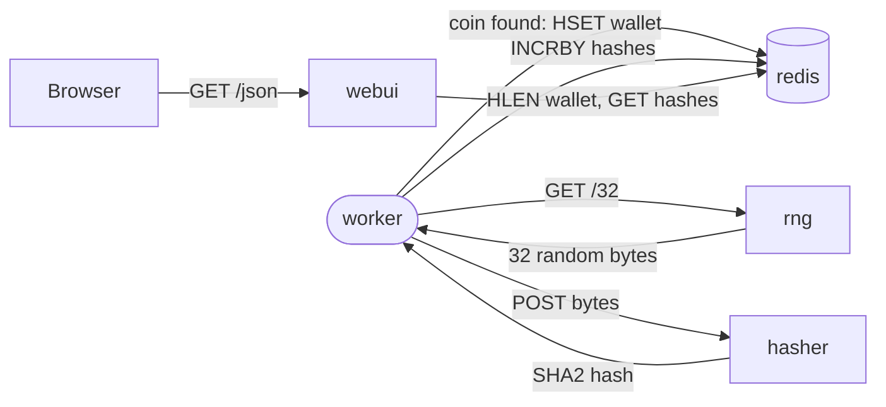

# k8coins Bootstrap Implementation Plan

> **For agentic workers:** REQUIRED SUB-SKILL: Use superpowers:subagent-driven-development to implement this plan task-by-task. Steps use checkbox (`- [ ]`) syntax for tracking.

**Goal:** Stand up `platformfix/k8coins`, a hardened, well-documented fork of `jpetazzo/container.training`'s DockerCoins demo app, as the throughline example Platform Fix's own workshops build on, with versioned images auto-published to GHCR on every merge to `main`.

**Architecture:** Four small polyglot services (rng/Python, hasher/Ruby, worker/Python, webui/Node.js) plus off-the-shelf redis, same topology as the original. Each service gets a multi-stage, non-root, pinned-dependency Dockerfile as a deliberate best-practices example, not just a working container. A GitHub Actions workflow on push to `main` reads the merged commit's conventional-commit type, computes one version for the whole repo, builds and pushes all four images to GHCR, and cuts a GitHub Release.

**Tech Stack:** Docker (multi-stage builds), GitHub Actions, GHCR, hadolint (Dockerfile linting in CI).

**Spec:** none as a separate document. Steve authorized compressing the usual brainstorm-then-spec phase for this bootstrap given explicit overnight urgency; the two decisions that would normally need his sign-off (repo name, release architecture) were ruled by the controller and recorded on bead `pf-sb-typ` in `platformfix/second-brain`'s beads database before this plan was written. Read that bead's notes for full rationale if anything here seems under-justified.

## Global Constraints

- Private repo for now. Public is the eventual plan (Steve's own reputation, "needs to be elite"), not yet.
- Every commit carries DCO sign-off (`git commit -s`) and a Conventional Commits subject (`feat:`, `fix:`, `docs:`, `ci:`, `chore:`). Commit little and often, don't batch a whole task into one commit if it naturally decomposes into smaller steps (e.g. "add the Dockerfile" then "add the healthcheck" then "switch to non-root" as separate commits within one task).
- Every piece of prose (README, any doc comments meant to be read, not code comments) goes through `/writing-antipatterns` before committing. No em dashes, no colon-before-lowercase-dramatic-reveal constructions (ordinary colons introducing lists or labels after a complete clause are fine, don't over-correct into stilted phrasing chasing this).
- Adapted from `jpetazzo/container.training`'s `dockercoins/` directory, Apache License 2.0 (verified directly against the source repo's `LICENSE` file earlier this session, not assumed). Apache 2.0 requires a `NOTICE` file preserving the original copyright and stating what changed. Every source file adapted from the original should say so in a comment.
- Every Dockerfile is a deliberate best-practices example: multi-stage builds (no build tooling or dev dependencies in the final image), a non-root `USER`, pinned dependency versions (a requirements/Gemfile/package-lock file, not ad hoc `pip install`/`gem install`/`npm install` of whatever's latest at build time), a recent stable base image tag (not a floating `latest`/unversioned tag), and a `HEALTHCHECK` where the service exposes an HTTP endpoint to check.
- No new GHCR credentials needed. GitHub Actions' built-in `GITHUB_TOKEN` can publish to GHCR once the workflow's `permissions: packages: write` is set and the repo's package visibility is configured (Task 7 handles this).
- Single unified repo version, not independently-versioned services. Ruled for simplicity, this is a teaching demo, not production microservices with independent release cadences.

---

### Task 1: Repo scaffold, licensing, and local dev compose

**Files:**
- Create: `LICENSE` (Apache 2.0, copied verbatim from the standard text)
- Create: `NOTICE`
- Create: `.gitignore`
- Create: `compose.yml`
- Create: `.github/workflows/.gitkeep` (placeholder, Task 7 fills this directory)

**Interfaces:**
- Produces: the repo's licensing posture and local dev entrypoint (`docker compose up`) that every later task's own testing depends on.

- [ ] **Step 1: Add the Apache 2.0 LICENSE**

Fetch the canonical text and write it verbatim:

```bash
curl -s https://www.apache.org/licenses/LICENSE-2.0.txt > LICENSE
```

- [ ] **Step 2: Write NOTICE**

Create `NOTICE`:

```
k8coins

Adapted from DockerCoins, part of jpetazzo/container.training
(https://github.com/jpetazzo/container.training), Copyright Jerome
Petazzoni and contributors, licensed under the Apache License 2.0.

Changes made: services renamed and Dockerfiles rewritten for multi-stage
builds, pinned dependencies, non-root users, and healthchecks. Application
logic (rng, hasher, worker, webui) is functionally the same as the
original with minor adaptations noted in each service's source comments.
```

- [ ] **Step 3: Write .gitignore**

```
node_modules/
.DS_Store
*.log
```

- [ ] **Step 4: Write the local dev compose file**

Create `compose.yml` (adapted from the original `dockercoins/compose.yml`, renamed services to match this repo, still buildable locally before any image is published):

```yaml
services:

  rng:
    build: rng
    ports:
      - "8001:80"

  hasher:
    build: hasher
    ports:
      - "8002:80"

  webui:
    build: webui
    ports:
      - "8000:80"

  redis:
    image: redis:7-alpine

  worker:
    build: worker
```

- [ ] **Step 5: Commit**

```bash
git add LICENSE NOTICE .gitignore compose.yml .github
git commit -s -m "chore: scaffold repo, licensing, and local dev compose"
git push
```

---

### Task 2: rng service (Python/Flask), the hardening pattern for the rest of the repo

This task establishes the hardening pattern the remaining three services follow. It's written in full detail; Tasks 3-5 apply the same pattern with less repeated rationale.

**Files:**
- Create: `rng/rng.py` (adapted from the original, comment noting the source)
- Create: `rng/requirements.txt`
- Create: `rng/Dockerfile`

**Interfaces:**
- Produces: a working image, buildable via `docker build -t k8coins-rng ./rng`, listening on port 80, responding to `GET /` and `GET /<n>` (returns `n` random bytes).

- [ ] **Step 1: The application code**

Create `rng/rng.py` (functionally identical to the original, one comment added):

```python
# Adapted from jpetazzo/container.training's dockercoins/rng/rng.py
# (Apache 2.0). See NOTICE.
from flask import Flask, Response
import os
import socket
import time

app = Flask(__name__)

# Enable debugging if the DEBUG environment variable is set and starts with Y
app.debug = os.environ.get("DEBUG", "").lower().startswith('y')

hostname = socket.gethostname()

urandom = os.open("/dev/urandom", os.O_RDONLY)


@app.route("/")
def index():
    return "RNG running on {}\n".format(hostname)


@app.route("/<int:how_many_bytes>")
def rng(how_many_bytes):
    # Simulate a little bit of delay
    time.sleep(0.1)
    return Response(
        os.read(urandom, how_many_bytes),
        content_type="application/octet-stream")


if __name__ == "__main__":
    app.run(port=80)
```

- [ ] **Step 2: Pin the dependency**

Create `rng/requirements.txt`. Check the actual current stable Flask release before pinning (`pip index versions flask` or check pypi.org directly) rather than assuming a version, pin to the real current one, e.g.:

```
Flask==3.1.0
```

(Replace `3.1.0` with whatever is genuinely the current stable release when you check, this exact number is illustrative, not the whole point, the point is a pinned file exists and matches a real release.)

- [ ] **Step 3: The hardened Dockerfile**

Create `rng/Dockerfile`. Check the actual current stable Python 3 release before pinning the base image tag (`python:<version>-alpine`) rather than assuming, same discipline as the requirements.txt pin:

```dockerfile
# Build stage: install dependencies with build tooling available.
FROM python:3.13-alpine AS builder
WORKDIR /app
COPY requirements.txt .
RUN pip install --no-cache-dir --user -r requirements.txt

# Final stage: copy only the installed packages and app code, no build
# tooling, no pip cache, no source of the requirements file.
FROM python:3.13-alpine
WORKDIR /app
RUN addgroup -S app && adduser -S app -G app
COPY --from=builder /root/.local /home/app/.local
COPY rng.py .
ENV PATH=/home/app/.local/bin:$PATH \
    FLASK_APP=rng \
    FLASK_RUN_HOST=:: \
    FLASK_RUN_PORT=80
USER app
EXPOSE 80
HEALTHCHECK --interval=10s --timeout=3s CMD wget -q -O- http://localhost:80/ || exit 1
CMD ["python", "-m", "flask", "run", "--without-threads"]
```

(Replace `3.13` in both `FROM` lines with whatever is genuinely the current stable Python release when you check. Keep both `FROM` lines using the identical tag.)

- [ ] **Step 4: Build and verify locally**

```bash
docker build -t k8coins-rng ./rng
docker run -d --name rng-test -p 8001:80 k8coins-rng
sleep 2
curl -s http://localhost:8001/
curl -s http://localhost:8001/16 | wc -c
docker inspect --format='{{.Config.User}}' k8coins-rng
docker stop rng-test && docker rm rng-test
```

Expected: first curl returns `RNG running on <hostname>`, second returns `16` (16 random bytes), the inspect shows `app` (confirms the container doesn't run as root by default, verify the actual running container too, not just the Dockerfile's `USER` line):

```bash
docker run -d --name rng-test2 -p 8001:80 k8coins-rng
sleep 2
docker exec rng-test2 whoami
docker stop rng-test2 && docker rm rng-test2
```

Expected: `app`, not `root`.

- [ ] **Step 5: Lint with hadolint**

```bash
docker run --rm -i hadolint/hadolint < rng/Dockerfile
```

Fix anything it flags before committing (or note explicitly why a specific rule is intentionally not followed, don't silently ignore a real finding).

- [ ] **Step 6: Commit**

```bash
git add rng/
git commit -s -m "feat(rng): add hardened multi-stage Dockerfile"
git push
```

---

### Task 3: hasher service (Ruby/Sinatra)

Same hardening pattern as Task 2. Ruby's native gem compilation genuinely needs build tooling (`build-base`) that the original Dockerfile leaves in the final image, this is the clearest case in the whole repo for why multi-stage builds matter, the build stage needs a compiler, the final stage should not ship one.

**Files:**
- Create: `hasher/hasher.rb`
- Create: `hasher/Gemfile`
- Create: `hasher/Gemfile.lock` (generated, not hand-written, see Step 2)
- Create: `hasher/Dockerfile`

**Interfaces:**
- Produces: a working image, buildable via `docker build -t k8coins-hasher ./hasher`, listening on port 80, `GET /` returns a running message, `POST /` with a body returns its SHA2 hash.

- [ ] **Step 1: The application code**

Create `hasher/hasher.rb`:

```ruby
# Adapted from jpetazzo/container.training's dockercoins/hasher/hasher.rb
# (Apache 2.0). See NOTICE.
require 'digest'
require 'sinatra'
require 'socket'

set :port, 80
set :bind, '0.0.0.0'

post '/' do
    # Simulate a bit of delay
    sleep 0.1
    content_type 'text/plain'
    "#{Digest::SHA2.new().update(request.body.read)}"
end

get '/' do
    "HASHER running on #{Socket.gethostname}\n"
end
```

(One real fix beyond the original: explicit `set :bind, '0.0.0.0'`, Sinatra defaults to binding `localhost` only as of Sinatra 2+, which would make the service unreachable from outside its own container. The original relied on `-o ::` as a CLI flag; setting it in-app is more robust and doesn't depend on how the process gets started.)

- [ ] **Step 2: Pin dependencies with a Gemfile**

Create `hasher/Gemfile`. Check the actual current stable Sinatra release before pinning rather than assuming:

```ruby
source 'https://rubygems.org'

gem 'sinatra', '~> 4.0'
gem 'puma'
```

(`puma` replaces the original's `thin`, actively maintained and the more common modern choice, thin's last real release is old. If you check and thin is genuinely still a better fit for some reason, use it instead and note why in a commit message, don't silently deviate without a reason recorded.)

Generate the lockfile for real rather than hand-writing it:

```bash
cd hasher && bundle lock && cd ..
```

- [ ] **Step 3: The hardened Dockerfile**

Create `hasher/Dockerfile`. Check the actual current stable Ruby release before pinning:

```dockerfile
FROM ruby:3.3-alpine AS builder
WORKDIR /app
RUN apk add --no-cache build-base
COPY Gemfile Gemfile.lock .
RUN bundle config set --local deployment 'true' && bundle install

FROM ruby:3.3-alpine
WORKDIR /app
RUN addgroup -S app && adduser -S app -G app
COPY --from=builder /app/vendor/bundle vendor/bundle
COPY --from=builder /app/.bundle .bundle
COPY --from=builder /usr/local/bundle /usr/local/bundle
COPY Gemfile Gemfile.lock hasher.rb .
USER app
EXPOSE 80
HEALTHCHECK --interval=10s --timeout=3s CMD wget -q -O- http://localhost:80/ || exit 1
CMD ["bundle", "exec", "ruby", "hasher.rb"]
```

(The exact set of paths to copy out of the builder stage depends on where `bundle install --deployment` actually puts things for the Ruby/bundler version you end up pinning, verify this empirically in Step 4 rather than trusting the paths above blindly, adjust if the build fails or the final image is missing gems.)

- [ ] **Step 4: Build and verify locally**

```bash
docker build -t k8coins-hasher ./hasher
docker run -d --name hasher-test -p 8002:80 k8coins-hasher
sleep 2
curl -s http://localhost:8002/
echo -n "test" | curl -s -X POST --data-binary @- http://localhost:8002/
docker exec hasher-test whoami
docker stop hasher-test && docker rm hasher-test
```

Expected: `GET /` returns `HASHER running on <hostname>`, `POST /` with body `test` returns a SHA2 hex digest, `whoami` returns `app`.

- [ ] **Step 5: Lint with hadolint, fix findings**

```bash
docker run --rm -i hadolint/hadolint < hasher/Dockerfile
```

- [ ] **Step 6: Commit**

```bash
git add hasher/
git commit -s -m "feat(hasher): add hardened multi-stage Dockerfile"
git push
```

---

### Task 4: worker service (Python)

Same pattern as Task 2, no exposed HTTP port (it's a background loop calling rng and hasher), so no HEALTHCHECK against an HTTP endpoint, use a process-liveness check instead.

**Files:**
- Create: `worker/worker.py`
- Create: `worker/requirements.txt`
- Create: `worker/Dockerfile`

**Interfaces:**
- Consumes: `rng` and `hasher`'s HTTP APIs (by service name, matching `compose.yml`'s service names from Task 1).
- Produces: a working image, buildable via `docker build -t k8coins-worker ./worker`, no exposed port.

- [ ] **Step 1: The application code**

Create `worker/worker.py` (functionally identical to the original, one comment added):

```python
# Adapted from jpetazzo/container.training's dockercoins/worker/worker.py
# (Apache 2.0). See NOTICE.
import logging
import os
from redis import Redis
import requests
import time

DEBUG = os.environ.get("DEBUG", "").lower().startswith("y")

log = logging.getLogger(__name__)
if DEBUG:
    logging.basicConfig(level=logging.DEBUG)
else:
    logging.basicConfig(level=logging.INFO)
    logging.getLogger("requests").setLevel(logging.WARNING)


redis = Redis("redis")


def get_random_bytes():
    r = requests.get("http://rng/32")
    return r.content


def hash_bytes(data):
    r = requests.post("http://hasher/",
                      data=data,
                      headers={"Content-Type": "application/octet-stream"})
    hex_hash = r.text
    return hex_hash


def work_loop(interval=1):
    deadline = 0
    loops_done = 0
    while True:
        if time.time() > deadline:
            log.info("{} units of work done, updating hash counter"
                     .format(loops_done))
            redis.incrby("hashes", loops_done)
            loops_done = 0
            deadline = time.time() + interval
        work_once()
        loops_done += 1


def work_once():
    log.debug("Doing one unit of work")
    time.sleep(0.1)
    random_bytes = get_random_bytes()
    hex_hash = hash_bytes(random_bytes)
    if not hex_hash.startswith('0'):
        log.debug("No coin found")
        return
    log.info("Coin found: {}...".format(hex_hash[:8]))
    created = redis.hset("wallet", hex_hash, random_bytes)
    if not created:
        log.info("We already had that coin")


if __name__ == "__main__":
    while True:
        try:
            work_loop()
        except:
            log.exception("In work loop:")
            log.error("Waiting 10s and restarting.")
            time.sleep(10)
```

- [ ] **Step 2: Pin dependencies**

Create `worker/requirements.txt`. Check actual current stable releases before pinning:

```
redis==5.2.1
requests==2.32.3
```

- [ ] **Step 3: The hardened Dockerfile**

Create `worker/Dockerfile`. Use the same Python version you pinned in Task 2 for consistency across the repo:

```dockerfile
FROM python:3.13-alpine AS builder
WORKDIR /app
COPY requirements.txt .
RUN pip install --no-cache-dir --user -r requirements.txt

FROM python:3.13-alpine
WORKDIR /app
RUN addgroup -S app && adduser -S app -G app
COPY --from=builder /root/.local /home/app/.local
COPY worker.py .
ENV PATH=/home/app/.local/bin:$PATH
USER app
HEALTHCHECK --interval=15s --timeout=3s \
  CMD pgrep -f worker.py || exit 1
CMD ["python", "worker.py"]
```

- [ ] **Step 4: Build and verify locally (needs rng, hasher, and redis running)**

```bash
docker build -t k8coins-worker ./worker
docker network create k8coins-test 2>/dev/null || true
docker run -d --name rng --network k8coins-test k8coins-rng
docker run -d --name hasher --network k8coins-test k8coins-hasher
docker run -d --name redis --network k8coins-test redis:7-alpine
docker run -d --name worker --network k8coins-test k8coins-worker
sleep 5
docker logs worker
docker exec worker whoami
docker rm -f rng hasher redis worker
docker network rm k8coins-test
```

Expected: `docker logs worker` shows real log lines like `N units of work done, updating hash counter` or `Coin found: ...`, not a crash traceback. `whoami` returns `app`.

- [ ] **Step 5: Lint with hadolint, fix findings**

```bash
docker run --rm -i hadolint/hadolint < worker/Dockerfile
```

- [ ] **Step 6: Commit**

```bash
git add worker/
git commit -s -m "feat(worker): add hardened multi-stage Dockerfile"
git push
```

---

### Task 5: webui service (Node.js/Express)

Same pattern again. The original has no `package.json`, dependencies get installed ad hoc at build time with whatever versions are current that day, not reproducible. Fixing that is the main departure from the original here.

**Files:**
- Create: `webui/webui.js`
- Create: `webui/package.json`
- Create: `webui/package-lock.json` (generated, not hand-written)
- Create: `webui/files/` (copy the four static asset files from the original: `index.html`, `d3.min.js`, `jquery-1.11.3.min.js`, `rickshaw.min.css`, `rickshaw.min.js`)
- Create: `webui/Dockerfile`

**Interfaces:**
- Consumes: `redis` (by service name).
- Produces: a working image, buildable via `docker build -t k8coins-webui ./webui`, listening on port 80, serves the static dashboard and a `/json` endpoint.

- [ ] **Step 1: Fetch the static assets from the original**

These are unmodified third-party front-end libraries (d3, jQuery, Rickshaw), fetch them as-is:

```bash
mkdir -p webui/files
for f in index.html d3.min.js jquery-1.11.3.min.js rickshaw.min.css rickshaw.min.js; do
  gh api "repos/jpetazzo/container.training/contents/dockercoins/webui/files/$f?ref=main" --jq '.content' | base64 -d > "webui/files/$f"
done
```

- [ ] **Step 2: The application code**

Create `webui/webui.js`:

```javascript
// Adapted from jpetazzo/container.training's dockercoins/webui/webui.js
// (Apache 2.0). See NOTICE.
import express from 'express';
import morgan from 'morgan';
import { createClient } from 'redis';

var client = await createClient({
  url: "redis://redis",
  socket: {
    family: 0
  }
})
    .on("error", function (err) {
        console.error("Redis error", err);
    })
    .connect();

var app = express();

app.use(morgan('common'));

app.get('/', function (req, res) {
    res.redirect('/index.html');
});

app.get('/json', async(req, res) => {
    var coins = await client.hLen('wallet');
    var hashes = await client.get('hashes');
    var now = Date.now() / 1000;
    res.json({
        coins: coins,
        hashes: hashes,
        now: now
    });
});

app.use(express.static('files'));

var server = app.listen(80, function () {
    console.log('WEBUI running on port 80');
});
```

- [ ] **Step 3: Pin dependencies with a real package.json**

Create `webui/package.json`. Check actual current stable major versions before pinning:

```json
{
  "name": "k8coins-webui",
  "version": "1.0.0",
  "private": true,
  "type": "module",
  "dependencies": {
    "express": "^4.21.2",
    "morgan": "^1.10.0",
    "redis": "^5.0.0"
  }
}
```

Generate the real lockfile (needs Node available locally, or run this inside a throwaway container if not):

```bash
cd webui && npm install --package-lock-only && cd ..
```

- [ ] **Step 4: The hardened Dockerfile**

Create `webui/Dockerfile`. Use an LTS Node release (even-numbered major, e.g. 22) rather than the original's non-LTS 23, check the actual current LTS before pinning:

```dockerfile
FROM node:22-alpine AS builder
WORKDIR /app
COPY package.json package-lock.json .
RUN npm ci --omit=dev

FROM node:22-alpine
WORKDIR /app
COPY --from=builder /app/node_modules node_modules
COPY package.json webui.js .
COPY files files
USER node
EXPOSE 80
HEALTHCHECK --interval=10s --timeout=3s CMD wget -q -O- http://localhost:80/index.html || exit 1
CMD ["node", "webui.js"]
```

(`node:*-alpine` images ship a built-in `node` user already, no need to create one, unlike the Python and Ruby base images.)

- [ ] **Step 5: Build and verify locally (needs redis running)**

```bash
docker build -t k8coins-webui ./webui
docker network create k8coins-test 2>/dev/null || true
docker run -d --name redis --network k8coins-test redis:7-alpine
docker run -d --name webui --network k8coins-test -p 8000:80 k8coins-webui
sleep 3
curl -s -o /dev/null -w "%{http_code}\n" http://localhost:8000/
curl -s http://localhost:8000/json
docker exec webui whoami
docker rm -f redis webui
docker network rm k8coins-test
```

Expected: first curl returns `302` (redirect to `/index.html`), `/json` returns real JSON like `{"coins":0,"hashes":null,"now":...}`, `whoami` returns `node`.

- [ ] **Step 6: Lint with hadolint, fix findings**

```bash
docker run --rm -i hadolint/hadolint < webui/Dockerfile
```

- [ ] **Step 7: Commit**

```bash
git add webui/
git commit -s -m "feat(webui): add hardened multi-stage Dockerfile"
git push
```

---

### Task 6: Full local integration test

**Files:** none created, this task only verifies Tasks 1-5 work together.

**Interfaces:**
- Consumes: `compose.yml` (Task 1) and all four Dockerfiles (Tasks 2-5).

- [ ] **Step 1: Bring the whole stack up via compose**

```bash
docker compose up -d --build
sleep 5
docker compose ps
```

Expected: all five services (`rng`, `hasher`, `webui`, `redis`, `worker`) show as running, none crash-looping.

- [ ] **Step 2: Verify the actual coin-mining loop works end to end**

```bash
sleep 15
curl -s http://localhost:8000/json
```

Expected: `hashes` is a real, non-null, non-zero number by this point (the worker has been running long enough to have found and counted some), proving rng, hasher, worker, redis, and webui are all actually talking to each other correctly, not just individually healthy.

- [ ] **Step 3: Tear down**

```bash
docker compose down
```

- [ ] **Step 4: If anything in Step 2 didn't work, fix the relevant service's task and re-verify before continuing** — this integration check is the real proof the fork works, not just that each image builds in isolation. No commit for this task itself (it's a verification-only task); if a fix was needed, that fix's commit belongs to the task whose service it fixed, go back and amend that task's ledger entry, don't create a phantom "fix everything" commit here.

---

### Task 7: CI/CD — conventional-commit-driven GHCR releases, plus PR linting

**Files:**
- Create: `.github/workflows/release.yml`
- Create: `.github/workflows/pr-check.yml`
- Modify: `.gitignore` if needed (unlikely)

**Interfaces:**
- Consumes: the four Dockerfiles (Tasks 2-5), each buildable standalone via `docker build ./<service>`.
- Produces: on push to `main`, a new version tag, four images pushed to `ghcr.io/platformfix/k8coins-<service>:<version>` and `:latest`, and a GitHub Release. On every PR, hadolint runs against all four Dockerfiles and the four images build (not pushed) to catch breakage before merge.

- [ ] **Step 1: Write the PR-check workflow**

Create `.github/workflows/pr-check.yml`:

```yaml
name: PR checks

on:
  pull_request:
    branches: [main]

jobs:
  lint-and-build:
    runs-on: ubuntu-latest
    strategy:
      matrix:
        service: [rng, hasher, worker, webui]
    steps:
      - uses: actions/checkout@v4

      - name: Lint Dockerfile
        uses: hadolint/hadolint-action@v3.1.0
        with:
          dockerfile: ${{ matrix.service }}/Dockerfile

      - name: Build image (no push)
        uses: docker/build-push-action@v6
        with:
          context: ./${{ matrix.service }}
          push: false
          tags: k8coins-${{ matrix.service }}:pr-check
```

- [ ] **Step 2: Write the release workflow**

Create `.github/workflows/release.yml`. This computes a version from the conventional-commit type of what was actually merged, tags it, builds and pushes all four images to GHCR, and creates a GitHub Release. Read it carefully and adjust the version-bump logic if the exact conventional-commit parsing doesn't match how `git log` actually formats the merged commit in your testing, verify this step empirically (Step 3) rather than trusting the shell logic blindly:

```yaml
name: Release

on:
  push:
    branches: [main]

permissions:
  contents: write
  packages: write

jobs:
  version:
    runs-on: ubuntu-latest
    outputs:
      version: ${{ steps.bump.outputs.version }}
      should_release: ${{ steps.bump.outputs.should_release }}
    steps:
      - uses: actions/checkout@v4
        with:
          fetch-depth: 0

      - name: Determine version bump from commit messages since last tag
        id: bump
        run: |
          LAST_TAG=$(git describe --tags --abbrev=0 2>/dev/null || echo "v0.0.0")
          echo "Last tag: $LAST_TAG"
          COMMITS=$(git log "${LAST_TAG}..HEAD" --pretty=format:"%s")
          if [ -z "$COMMITS" ]; then
            echo "should_release=false" >> "$GITHUB_OUTPUT"
            exit 0
          fi
          BUMP="patch"
          if echo "$COMMITS" | grep -qE "^[a-z]+(\(.+\))?!:|BREAKING CHANGE"; then
            BUMP="major"
          elif echo "$COMMITS" | grep -qE "^feat(\(.+\))?:"; then
            BUMP="minor"
          fi
          VERSION="${LAST_TAG#v}"
          IFS='.' read -r MAJOR MINOR PATCH <<< "$VERSION"
          case "$BUMP" in
            major) MAJOR=$((MAJOR + 1)); MINOR=0; PATCH=0 ;;
            minor) MINOR=$((MINOR + 1)); PATCH=0 ;;
            patch) PATCH=$((PATCH + 1)) ;;
          esac
          NEW_VERSION="v${MAJOR}.${MINOR}.${PATCH}"
          echo "New version: $NEW_VERSION"
          echo "version=$NEW_VERSION" >> "$GITHUB_OUTPUT"
          echo "should_release=true" >> "$GITHUB_OUTPUT"

  release:
    needs: version
    if: needs.version.outputs.should_release == 'true'
    runs-on: ubuntu-latest
    strategy:
      matrix:
        service: [rng, hasher, worker, webui]
    steps:
      - uses: actions/checkout@v4

      - name: Log in to GHCR
        uses: docker/login-action@v3
        with:
          registry: ghcr.io
          username: ${{ github.actor }}
          password: ${{ secrets.GITHUB_TOKEN }}

      - name: Build and push
        uses: docker/build-push-action@v6
        with:
          context: ./${{ matrix.service }}
          push: true
          tags: |
            ghcr.io/platformfix/k8coins-${{ matrix.service }}:${{ needs.version.outputs.version }}
            ghcr.io/platformfix/k8coins-${{ matrix.service }}:latest

  tag-and-release:
    needs: [version, release]
    if: needs.version.outputs.should_release == 'true'
    runs-on: ubuntu-latest
    steps:
      - uses: actions/checkout@v4

      - name: Create tag and GitHub Release
        env:
          GH_TOKEN: ${{ secrets.GITHUB_TOKEN }}
        run: |
          VERSION="${{ needs.version.outputs.version }}"
          git tag "$VERSION"
          git push origin "$VERSION"
          gh release create "$VERSION" --generate-notes --title "$VERSION"
```

- [ ] **Step 3: Verify empirically, don't just trust the YAML reads correctly**

Push a trivial `fix:` commit (e.g. a comment tweak in one Dockerfile) directly to a throwaway test branch first, open a PR against `main` to confirm `pr-check.yml` runs and passes, then merge it and confirm `release.yml` actually fires, computes `v0.0.1` (assuming no prior tag), and check the Actions run logs for whether the build-and-push step succeeded, not just that the workflow triggered. If GHCR push fails on a permissions error, the repo's package visibility settings likely need adjusting (Settings → Actions → General → Workflow permissions, or the package's own visibility once first created), fix it and re-verify, don't leave a broken release pipeline and move on assuming it's "probably fine."

- [ ] **Step 4: Commit**

```bash
git add .github/workflows/
git commit -s -m "ci: add PR checks and conventional-commit-driven GHCR releases"
git push
```

---

### Task 8: README

**Files:**
- Create: `README.md`

**Interfaces:**
- Consumes: the actual repo structure built in Tasks 1-7, documents what's real, doesn't invent anything.

- [ ] **Step 1: Write the README**

Cover, in this order: what k8coins is and why it exists (the throughline demo app for Platform Fix's workshops, what problem it demonstrates: a small polyglot microservices app, deliberately using different languages per service to show orchestration doesn't care what runtime a service is written in), the architecture (the five services, what each does, how data flows between them: rng generates random bytes, worker pulls them and asks hasher to hash them, checks for a "coin" (a hash starting with a zero), stores finds in redis, webui shows the live rate), how to run it locally (`docker compose up`), where the published images live (GHCR, one per service, versioned), how versioning/releases work (conventional commits drive the bump, merges to `main` auto-publish), the Dockerfile best-practices this repo demonstrates (multi-stage builds, non-root users, pinned dependencies, healthchecks, hadolint in CI) since that's a deliberate teaching purpose here, and attribution (points at `NOTICE`).

Write this as an actual senior engineer would for a repo they're proud of: clear, concrete, no padding, no AI-tell constructions. This is going out under Steve's name eventually, hold it to that bar even while the repo is still private.

- [ ] **Step 2: Add a Mermaid diagram of the actual data flow, in the architecture section**

Steve asked for this directly. Use the real request/data flow traced from the actual application code in Tasks 2-5, not a generic microservices diagram:



Verify this renders correctly on GitHub before committing (push to a scratch branch and view the rendered file in the GitHub UI, or use a local Mermaid preview, don't just trust the syntax is valid because it looks right) and that it actually matches the real code paths in `worker/worker.py`, `rng/rng.py`, `hasher/hasher.rb`, and `webui/webui.js` as built in Tasks 2-5, not this plan's description of them, the plan could itself have drifted from what actually got built.

- [ ] **Step 3: Run the whole README through `/writing-antipatterns`**

Full pass, not a grep. Fix anything it finds.

- [ ] **Step 4: Commit**

```bash
git add README.md
git commit -s -m "docs: add README"
git push
```

---

## Final verification (run after all tasks complete)

- [ ] Fresh clone check: clone the repo to a scratch directory, `docker compose up -d --build`, confirm the integration check from Task 6 still passes (real, non-zero `hashes` count after 15s) from a clean checkout, not just the session that built it.
- [ ] Confirm at least one real release has landed on GHCR: `gh api /orgs/platformfix/packages?package_type=container` (or check the repo's Packages sidebar on github.com) shows four `k8coins-*` packages, each with at least one version tag beyond `latest`.
